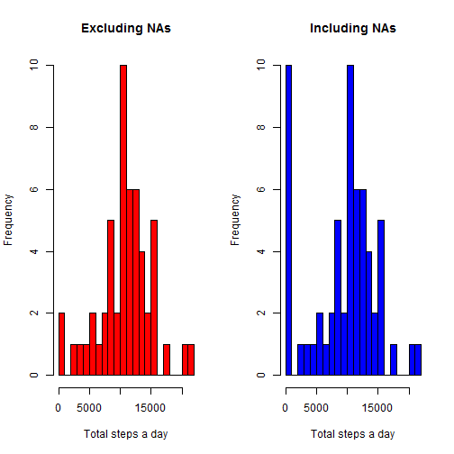
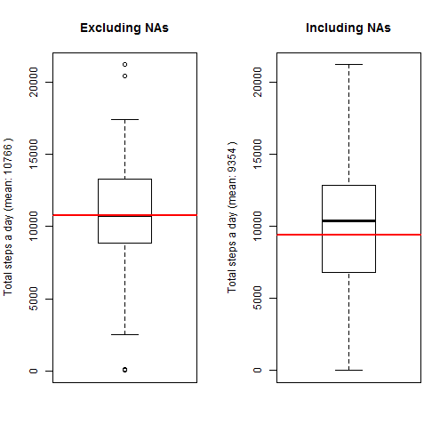
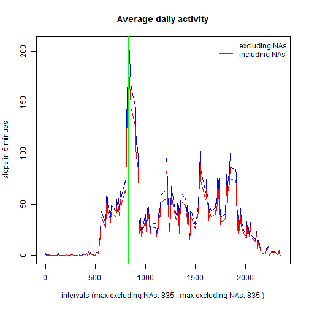
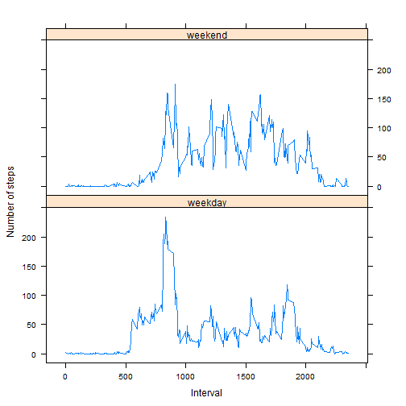

In this assignment some exploratory analysis has been done using <a href="https://d396qusza40orc.cloudfront.net/repdata%2Fdata%2Factivity.zip"> Activity monitoring dataset</a>[52K] dataset.

###Loading data
There are 3 variables in the dataset:

- <b>steps</b>: Number of steps taking in a 5-minute interval (missing values are coded as `NA`)
- <b>date</b>: The date on which the measurement was taken in YYYY-MM-DD format
- <b>interval</b>: Identifier for the 5-minute interval in which measurement was taken

As a first step data is loaded into a data frame in R and some basic checks are performed.


```r
data.r <- read.csv("activity.csv", header=TRUE, sep=",", as.is=TRUE)
nrow(data.r)
```

```
## [1] 17568
```

```r
summary(data.r)
```

```
##      steps            date              interval     
##  Min.   :  0.00   Length:17568       Min.   :   0.0  
##  1st Qu.:  0.00   Class :character   1st Qu.: 588.8  
##  Median :  0.00   Mode  :character   Median :1177.5  
##  Mean   : 37.38                      Mean   :1177.5  
##  3rd Qu.: 12.00                      3rd Qu.:1766.2  
##  Max.   :806.00                      Max.   :2355.0  
##  NA's   :2304
```
###Missing values and analysis dataset preparation
Missing values are checked in the loaded dataset

```r
colSums(is.na(data.r))
```

```
##    steps     date interval 
##     2304        0        0
```
Two datasets are prepared for the analysis:

- Excluding any missing data in steps 
- Replacing missing data in steps with the median steps across all days and all intervals

```r
## dataset 1
data.f1 <- data.r[!is.na(data.r$steps),]
all(colSums(is.na(data.f1))==0)
```

```
## [1] TRUE
```

```r
## dataset 2
data.f2 <- as.data.frame(data.r)
data.f2[is.na(data.f2$steps),1] <- median(data.f2$steps, na.rm=TRUE)
all(colSums(is.na(data.f2))==0)
```

```
## [1] TRUE
```

###Steps taken per day

Daily steps summary (total steps per day, median steps per day, mean steps per day) has been calculated for this part of analysis: 

```r
## dataset 1
sm <-aggregate(data.f1$steps, by=list(data.f1$date), function(x){c(sum(x), median(x), mean(x))})
data.s1<- cbind(as.data.frame(sm$Group), sm$x)
names(data.s1) <- c("date", "totSteps", "medSteps", "meaSteps")
data.s1
```

```
##          date totSteps medSteps   meaSteps
## 1  2012-10-02      126        0  0.4375000
## 2  2012-10-03    11352        0 39.4166667
## 3  2012-10-04    12116        0 42.0694444
## 4  2012-10-05    13294        0 46.1597222
## 5  2012-10-06    15420        0 53.5416667
## 6  2012-10-07    11015        0 38.2465278
## 7  2012-10-09    12811        0 44.4826389
## 8  2012-10-10     9900        0 34.3750000
## 9  2012-10-11    10304        0 35.7777778
## 10 2012-10-12    17382        0 60.3541667
## 11 2012-10-13    12426        0 43.1458333
## 12 2012-10-14    15098        0 52.4236111
## 13 2012-10-15    10139        0 35.2048611
## 14 2012-10-16    15084        0 52.3750000
## 15 2012-10-17    13452        0 46.7083333
## 16 2012-10-18    10056        0 34.9166667
## 17 2012-10-19    11829        0 41.0729167
## 18 2012-10-20    10395        0 36.0937500
## 19 2012-10-21     8821        0 30.6284722
## 20 2012-10-22    13460        0 46.7361111
## 21 2012-10-23     8918        0 30.9652778
## 22 2012-10-24     8355        0 29.0104167
## 23 2012-10-25     2492        0  8.6527778
## 24 2012-10-26     6778        0 23.5347222
## 25 2012-10-27    10119        0 35.1354167
## 26 2012-10-28    11458        0 39.7847222
## 27 2012-10-29     5018        0 17.4236111
## 28 2012-10-30     9819        0 34.0937500
## 29 2012-10-31    15414        0 53.5208333
## 30 2012-11-02    10600        0 36.8055556
## 31 2012-11-03    10571        0 36.7048611
## 32 2012-11-05    10439        0 36.2465278
## 33 2012-11-06     8334        0 28.9375000
## 34 2012-11-07    12883        0 44.7326389
## 35 2012-11-08     3219        0 11.1770833
## 36 2012-11-11    12608        0 43.7777778
## 37 2012-11-12    10765        0 37.3784722
## 38 2012-11-13     7336        0 25.4722222
## 39 2012-11-15       41        0  0.1423611
## 40 2012-11-16     5441        0 18.8923611
## 41 2012-11-17    14339        0 49.7881944
## 42 2012-11-18    15110        0 52.4652778
## 43 2012-11-19     8841        0 30.6979167
## 44 2012-11-20     4472        0 15.5277778
## 45 2012-11-21    12787        0 44.3993056
## 46 2012-11-22    20427        0 70.9270833
## 47 2012-11-23    21194        0 73.5902778
## 48 2012-11-24    14478        0 50.2708333
## 49 2012-11-25    11834        0 41.0902778
## 50 2012-11-26    11162        0 38.7569444
## 51 2012-11-27    13646        0 47.3819444
## 52 2012-11-28    10183        0 35.3576389
## 53 2012-11-29     7047        0 24.4687500
```

```r
## dataset 2
sm <-aggregate(data.f2$steps, by=list(data.f2$date), function(x){c(sum(x), median(x), mean(x))})
data.s2<- cbind(as.data.frame(sm$Group), sm$x)
names(data.s2) <- c("date", "totSteps", "medSteps", "meaSteps")
data.s2
```

```
##          date totSteps medSteps   meaSteps
## 1  2012-10-01        0        0  0.0000000
## 2  2012-10-02      126        0  0.4375000
## 3  2012-10-03    11352        0 39.4166667
## 4  2012-10-04    12116        0 42.0694444
## 5  2012-10-05    13294        0 46.1597222
## 6  2012-10-06    15420        0 53.5416667
## 7  2012-10-07    11015        0 38.2465278
## 8  2012-10-08        0        0  0.0000000
## 9  2012-10-09    12811        0 44.4826389
## 10 2012-10-10     9900        0 34.3750000
## 11 2012-10-11    10304        0 35.7777778
## 12 2012-10-12    17382        0 60.3541667
## 13 2012-10-13    12426        0 43.1458333
## 14 2012-10-14    15098        0 52.4236111
## 15 2012-10-15    10139        0 35.2048611
## 16 2012-10-16    15084        0 52.3750000
## 17 2012-10-17    13452        0 46.7083333
## 18 2012-10-18    10056        0 34.9166667
## 19 2012-10-19    11829        0 41.0729167
## 20 2012-10-20    10395        0 36.0937500
## 21 2012-10-21     8821        0 30.6284722
## 22 2012-10-22    13460        0 46.7361111
## 23 2012-10-23     8918        0 30.9652778
## 24 2012-10-24     8355        0 29.0104167
## 25 2012-10-25     2492        0  8.6527778
## 26 2012-10-26     6778        0 23.5347222
## 27 2012-10-27    10119        0 35.1354167
## 28 2012-10-28    11458        0 39.7847222
## 29 2012-10-29     5018        0 17.4236111
## 30 2012-10-30     9819        0 34.0937500
## 31 2012-10-31    15414        0 53.5208333
## 32 2012-11-01        0        0  0.0000000
## 33 2012-11-02    10600        0 36.8055556
## 34 2012-11-03    10571        0 36.7048611
## 35 2012-11-04        0        0  0.0000000
## 36 2012-11-05    10439        0 36.2465278
## 37 2012-11-06     8334        0 28.9375000
## 38 2012-11-07    12883        0 44.7326389
## 39 2012-11-08     3219        0 11.1770833
## 40 2012-11-09        0        0  0.0000000
## 41 2012-11-10        0        0  0.0000000
## 42 2012-11-11    12608        0 43.7777778
## 43 2012-11-12    10765        0 37.3784722
## 44 2012-11-13     7336        0 25.4722222
## 45 2012-11-14        0        0  0.0000000
## 46 2012-11-15       41        0  0.1423611
## 47 2012-11-16     5441        0 18.8923611
## 48 2012-11-17    14339        0 49.7881944
## 49 2012-11-18    15110        0 52.4652778
## 50 2012-11-19     8841        0 30.6979167
## 51 2012-11-20     4472        0 15.5277778
## 52 2012-11-21    12787        0 44.3993056
## 53 2012-11-22    20427        0 70.9270833
## 54 2012-11-23    21194        0 73.5902778
## 55 2012-11-24    14478        0 50.2708333
## 56 2012-11-25    11834        0 41.0902778
## 57 2012-11-26    11162        0 38.7569444
## 58 2012-11-27    13646        0 47.3819444
## 59 2012-11-28    10183        0 35.3576389
## 60 2012-11-29     7047        0 24.4687500
## 61 2012-11-30        0        0  0.0000000
```

Next, the histogram of total number of steps taken each day is generated:


```r
##png(filename="plot1.png")
par(mfrow=c(1,2))
## dataset 1
hist(data.s1$totSteps, breaks=20, xlab = "Total steps a day", main = "Excluding NAs", col="red")
## dataset 2
hist(data.s2$totSteps, breaks=20, xlab = "Total steps a day", main = "Including NAs", col="blue")
```

 

```r
##dev.off()
```

Also, the Box plot of total number of steps taken each day highlighting the mean as red horizontal line.

```r
m1 <-round(mean(data.s1$totSteps),0)
m2 <-round(mean(data.s2$totSteps),0)
##png(filename="plot2.png")
par(mfrow=c(1,2))
## dataset 1
boxplot(data.s1$totSteps, ylab = paste("Total steps a day (mean:", m1, ")"), main = "Excluding NAs")
abline(h=mean(data.s1$totSteps),col="red", lwd=2)
## dataset 2
boxplot(data.s2$totSteps, ylab = paste("Total steps a day (mean:",m2,")"), main = "Including NAs")
abline(h=mean(data.s2$totSteps),col="red", lwd=2)
```

 

```r
##dev.off()
```

It is seen that the difference in the spread of data across the time is not that signification including/excluding the `NA's`, however, the mean has changed about a thousand steps.

###Average daily activity

Average daily activity pattern is analyzed including and excluding `NA's` using the time series plot. 

```r
## dataset 1
sm1 <-aggregate(data.f1$steps, by=list(data.f1$interval), mean)
maxStepInterval1 <- sm1[sm1["x"]==max(sm1["x"]),1]
r1 <- range(sm1$x)
## dataset 2
sm2 <-aggregate(data.f2$steps, by=list(data.f2$interval), mean)
maxStepInterval2 <- sm2[sm2["x"]==max(sm2["x"]),1]
r2 <- range(sm2$x)
y.rng <-c(min(r1, r2), max(r1,r2))

##png(filename="plot3.png")
par(mfrow=c(1,1))
plot(sm1$Group, sm1$x, type="l", col="blue", 
     xlab= paste("intervals (max excluding NAs:", maxStepInterval1, ", max excluding NAs:", maxStepInterval2,")"), 
     main="Average daily activity", ylab="steps in 5 minues", ylim=y.rng)
lines(sm2$Group, sm2$x, col="red", type="l")
abline(v=sm1[sm1["x"]==max(sm1["x"]),1], col="black", lwd=2)
abline(v=sm2[sm2["x"]==max(sm2["x"]),1], col="green", lwd=2)
legend("topright", legend=c("excluding NAs","including NAs"), col = c("blue","red"), ncol = 1, lwd = 1)
```

 

```r
##dev.off()
```

It is seen in the time series plot that the patterns have not changed significantly due to inclusion and exclusion of the `NA's` in the dataset. The maximum steps interval remain same for both at 8:35 AM which is shown as green line in both plots.

###Weekdays/Weekends activity pattern

Average activity pattern during weekdays and weekends is also analyzed excluding `NA's` only as no difference has been observed in average daily actipity pattern including and excluding `NA's`.


```r
## dataset 1
##png(filename="plot4.png")
data.f1$dateT <- strptime(data.f1$date, "%Y-%m-%d") 
data.f1$dateType <- weekdays(data.f1$dateT, abbreviate=TRUE)
data.f1[data.f1$dateType %in% c("Sat","Sun"),5]<- "weekend"
data.f1[data.f1$dateType %in% c("Mon","Tue", "Wed","Thu","Fri"),5]<- "weekday"
data.f1$dateType <- as.factor(data.f1$dateType)
sm3 <-aggregate(data.f1[data.f1$dateType=="weekday",1], by=list(data.f1[data.f1$dateType=="weekday",3]), mean)
data.s3 <- cbind(as.data.frame("weekday"), sm3$Group, sm3$x)
names(data.s3)<- c("dateType", "interval", "steps")

sm4 <-aggregate(data.f1[data.f1$dateType=="weekend",1], by=list(data.f1[data.f1$dateType=="weekend",3]), mean)
data.s4 <-cbind(as.data.frame("weekend"), sm4$Group, sm4$x)
names(data.s4)<- c("dateType", "interval", "steps")

data.s5<- rbind(data.s3, data.s4)

library(lattice)
xyplot(data.s5$steps~data.s5$interval | data.s5$dateType, type="l", 
       xlab = "Interval", ylab = "Number of steps",  layout=c(1,2))
```

 

```r
##dev.off()
```

A pattern of higher number of steps in the morning is seen during weekdays(5:00 AM to 9:30 AM), where in weekends a pattern of higher number of steps is seen during the rest of the day(9:30 AM to 8:00 PM) in the weekend/weekday activity plot.
